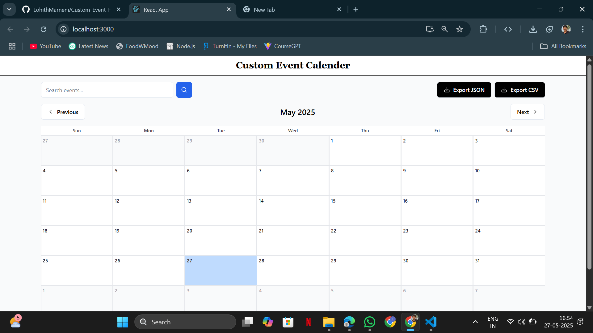

Custom Event Calendar
    
    Custom Event Calendar is an interactive, dynamic calendar application built using React, Radix UI, and Tailwind CSS. It allows users to efficiently manage their schedules by adding, editing,     deleting, and viewing events. The application supports recurring events, drag-and-drop rescheduling, and event persistence, ensuring a seamless user experience.
    This project was submitted as part of the `Frontend Intern - Assignment - Flam`

Features
Core Features:

    Monthly View Calendar:

        Traditional monthly calendar with the ability to navigate between months.

        Highlights the current day for better visibility.

    Event Management:

        Add, edit, and delete events.

        Supports fields like title, date, time, description, recurrence options, and event category.

    Recurring Events:

        Daily, weekly, monthly, and custom recurrence options.

        Correct visualization of recurring events across the calendar.

    Drag-and-Drop Rescheduling:

        Drag events to reschedule them.

        Handles conflicts during rescheduling with appropriate notifications.

    Event Persistence:

        Data persistence using local storage ensures events are saved even after a page refresh.

    Responsive Design:

        Works seamlessly across desktop and mobile devices.

        Adapts layout for smaller screens with a daily or weekly view.

    Event Filtering and Searching:

    Dynamic search and category-based filtering.

Installation
    
    Prerequisites:
        Node.js (v14 or higher)
        npm (v6 or higher) or yarn

        
    Steps:
    Clone the repository:
        git clone https://github.com/Ch-Lokesh-21/custom-event-calendar.git
        cd custom-event-calendar

        
    Install dependencies:
        npm install

        
    Start the development server:
        npm start

        
    Open the application in your browser:
        http://localhost:3000

Usage
    
    Adding Events:
        Click on a specific day in the calendar to open the event creation form.

        Fill in the event details, including title, date/time, description, recurrence, and category.

    Editing Events:
        Click on an existing event to open the edit form.

        Update the desired fields and save changes.

    Deleting Events:
        Click on an event and use the "Delete" button to remove it.

    Drag-and-Drop Rescheduling:
        Drag events from one day to another directly on the calendar.

    Built With
        React: Component-based framework for building the user interface.

        Radix UI: For accessible and customizable UI components.

        Tailwind CSS: For utility-first styling.

        date-fns: To handle date and time operations.

        React DnD: To enable drag-and-drop functionality.

